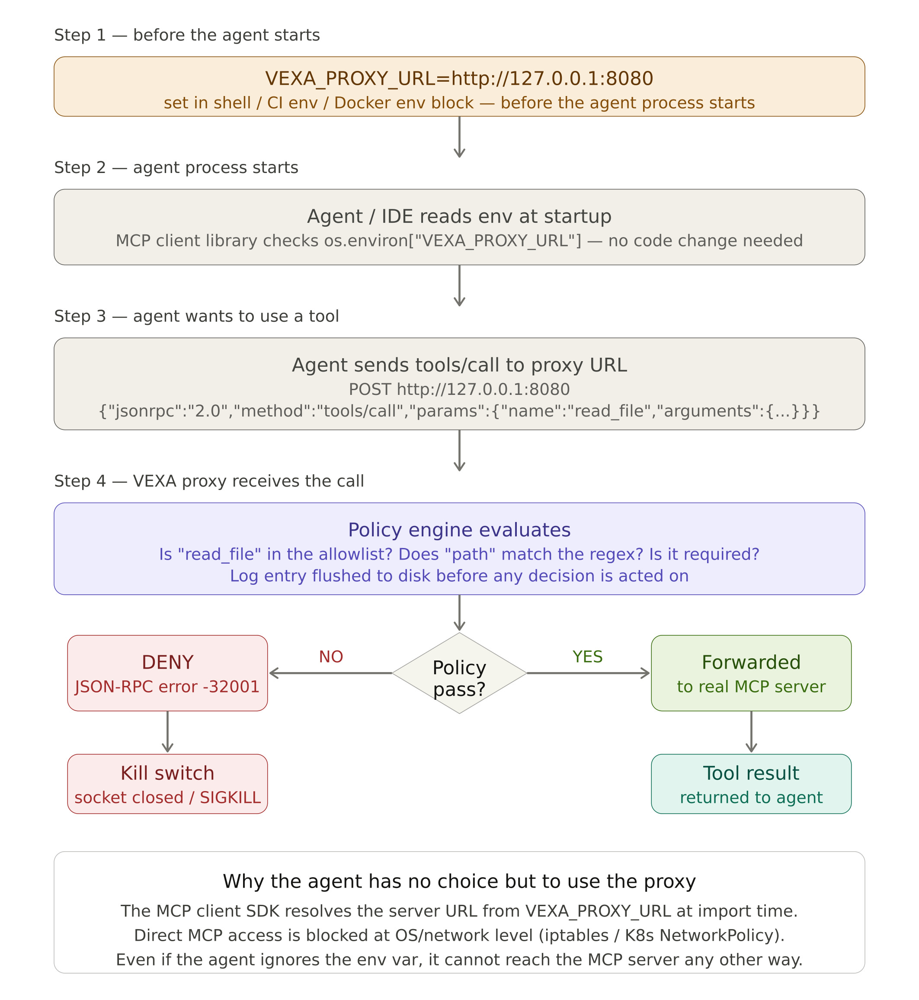

# VEXA AgentWall

> **Local-first sidecar proxy enforcing deterministic security policies for autonomous AI agents over MCP.**

[](LICENSE)
[]()
[]()

VEXA AgentWall sits between an AI agent runtime and its MCP (Model Context Protocol) tool servers. It intercepts every JSON-RPC tool call, evaluates it against a YAML-defined policy, and either allows or denies the call — while writing a cryptographically chained, tamper-evident audit log of every decision.

---

## Table of Contents

- [Why AgentWall?](#why-agentwall)
- [Key Benefits](#key-benefits)
- [Architecture](#architecture)
- [Quickstart](#quickstart)
- [Policy Reference](#policy-reference)
- [CLI Reference](#cli-reference)
- [Features (Phase 1 MVP)](#features-phase-1-mvp)
- [Demo UI](#demo-ui)
- [Security Guarantees & Known Limitations](#security-guarantees--known-limitations)
- [Building from Source](#building-from-source)
- [License](#license)

---

## Why AgentWall?

Autonomous AI agents can call tools with real-world consequences — writing files, executing shell commands, making network requests. Without an enforcement layer, a hallucinated tool call or a compromised agent can cause irreversible damage.

AgentWall provides a **zero-trust enforcement boundary** with zero changes required to your agent code.

---

## Key Benefits

| Benefit | Description |
|---|---|
| 🛡️ **Zero-Trust by Default** | Explicit allow-list policy. Everything not permitted is denied. |
| 🔐 **Cryptographic Auditability** | Every decision is HMAC-SHA256 chained — tamper-evident and compliance-ready. |
| 🔌 **Agent-Agnostic** | Works as a transparent sidecar; no agent code changes required. |
| ⚡ **Ultra-Lightweight** | Single Rust binary, zero external runtime dependencies, <10ms latency overhead. |
| 🔄 **Operational Resilience** | Token-bucket rate limiting prevents runaway loops and API flooding. |
| 🧪 **Frictionless Development** | Dry-run mode and a pre-flight `check` tool let you iterate safely. |

---

## Architecture

```
┌─────────────────────────────────────────────────────────┐
│                     AI Agent Runtime                    │
│            (any framework: LangChain, AutoGPT, …)       │
└──────────────────────┬──────────────────────────────────┘
                       │  JSON-RPC over HTTP
                       ▼
┌─────────────────────────────────────────────────────────┐
│               VEXA AgentWall Proxy                      │
│  ┌─────────────┐  ┌──────────────┐  ┌───────────────┐  │
│  │ Policy Eval │  │ Rate Limiter │  │  Audit Logger │  │
│  │  (YAML)     │  │(Token Bucket)│  │(HMAC-SHA256)  │  │
│  └─────────────┘  └──────────────┘  └───────────────┘  │
└──────────────────────┬──────────────────────────────────┘
                       │  Allowed calls forwarded
                       ▼
┌─────────────────────────────────────────────────────────┐
│                  MCP Tool Servers                       │
│        (filesystem, shell, search, database, …)         │
└─────────────────────────────────────────────────────────┘
```

**Key design decisions:**
- **Deny-by-default** — only explicitly permitted tools/parameters pass through.
- **Regex-anchored patterns** — all string parameters are validated against anchored regex (`^(?:...)$`) to prevent partial-match bypasses.
- **Chained audit log** — each entry's HMAC includes the previous entry's hash, forming a tamper-evident chain.
- **Kill modes** — on violation, the proxy can close the connection, SIGKILL the agent process, or both.

---

## How It Works (Step-by-Step)

VEXA AgentWall acts as a mandatory enforcement layer between your AI agent and its tools.



### 1. Before the Agent Starts
The `VEXA_PROXY_URL` environment variable is set (e.g., `http://127.0.0.1:8080`). This happens in your shell, CI/CD pipeline, or Docker configuration.

### 2. Agent Initialization
When the AI agent (or IDE) starts, the MCP client library automatically checks for `VEXA_PROXY_URL`. No code changes are required for most standard MCP implementations.

### 3. Tool Execution Attempt
When the agent decides to use a tool, it sends the JSON-RPC request to the proxy URL instead of the tool server directly.
*   **Request:** `POST http://127.0.0.1:8080`
*   **Payload:** `{"jsonrpc": "2.0", "method": "tools/call", "params": {...}}`

### 4. Policy Evaluation & Enforcement
The VEXA proxy receives the call and immediately flushes a log entry to disk. The policy engine then evaluates the call:
*   **Validation:** Is the tool in the allowlist? Do parameters match the required regex patterns?
*   **On Failure (DENY):** The proxy returns a JSON-RPC error `-32001`. If configured, it triggers a **kill switch** (closes the socket or sends `SIGKILL` to the agent).
*   **On Success (ALLOW):** The call is forwarded to the actual MCP server, and the result is passed back to the agent.

---

> [!IMPORTANT]
> **Why the agent has no choice but to use the proxy:**
> 1. **SDK-Level Resolution:** Most MCP SDKs resolve the server URL from `VEXA_PROXY_URL` at import time.
> 2. **Network Egress Control:** Direct MCP access should be blocked at the OS or network level (e.g., `iptables` or K8s `NetworkPolicy`). Even if an agent tries to ignore the environment variable, it cannot reach the MCP server any other way.

---

## Quickstart

The recommended path starts locally in dry-run mode — no CI/CD, no DevOps, no pipeline changes. 

### Prerequisites

- **Rust Toolchain**: `cargo` and `rustc` (v1.75+). Install from [rustup.rs](https://rustup.rs/).
- **Python 3.8+**: Required for running the included simulation scripts and the Demo UI bridge.
- **Git**: To clone and manage the repository.

**Step 1 — Clone the repository**

```bash
git clone https://github.com/noviqtechnologies/agentwall.git
cd agentwall
```

**Step 2 — Build the binary**

Before you start, build the project and move the binary to the root for easier access:

*macOS/Linux (Bash):*
```bash
cargo build --release
cp target/release/agentwall .
```

*Windows (PowerShell):*
```powershell
cargo build
copy target\debug\agentwall.exe .
```

**Step 3 — Start in dry-run mode without a policy**

Open a terminal and start the proxy.

*Bash:*
```bash
./agentwall start --dry-run --listen 127.0.0.1:8080 --log-path audit.log &
# Wait for proxy
until curl -sf http://127.0.0.1:8080/healthz; do sleep 0.1; done
```

*PowerShell:*
```powershell
Start-Process -FilePath ".\agentwall.exe" -ArgumentList "start", "--dry-run", "--listen", "127.0.0.1:8080", "--log-path", "audit.log"
```

**Step 4 — Point your agent at the proxy (or simulate a call)**

To test the proxy immediately, you can use the provided quickstart agent script.

*PowerShell (Windows):*
```powershell
# Set the environment variable for your session
$env:VEXA_PROXY_URL="http://127.0.0.1:8080"

# Run the simulated agent
python quickstart_agent.py
```

*Bash:*
```bash
# Set environment variable
export VEXA_PROXY_URL=http://127.0.0.1:8080

# Simulate a tool call
curl -X POST http://127.0.0.1:8080 -H "Content-Type: application/json" -d '{"jsonrpc": "2.0", "method": "tools/call", "params": {"name": "read_file", "arguments": {"path": "test.txt"}}, "id": 1}'
```

Once you are ready, you can run the provided quickstart agent:
`python quickstart_agent.py`

**Step 5 — See what your agent actually did**
```bash
# macOS/Linux (Bash):
./agentwall report audit.log --format text

# Windows (PowerShell):
.\agentwall.exe report audit.log --format text
```

**Step 6 — Generate a starter policy**
```bash
# macOS/Linux (Bash):
./agentwall init --from-log audit.log

# Windows (PowerShell):
.\agentwall.exe init --from-log audit.log
```

**Step 7 — Tune the generated policy and re-run with enforcement**

Edit `policy.yaml` — tighten regexes, remove tools your agent shouldn't need. Then pre-flight validate:

```bash
# Windows:
.\agentwall.exe check --policy policy.yaml audit.log

# macOS/Linux:
./agentwall check --policy policy.yaml audit.log
```

Finally, run with enforcement enabled (no `--dry-run`):

*macOS/Linux (Bash):*
```bash
# Adding & at the end runs it in the background
./agentwall start --policy policy.yaml --listen 127.0.0.1:8080 --log-path audit.log --kill-mode both &
```

*Windows (PowerShell):*
```powershell
# Start-Process ensures the proxy runs in a separate window so it doesn't block your terminal
Start-Process -FilePath ".\agentwall.exe" -ArgumentList "start", "--policy", "policy.yaml", "--listen", "127.0.0.1:8080", "--log-path", "audit.log", "--kill-mode", "both"
```

**Step 8 — Verify the log**

*Note: If you didn't run the proxy in the background in the previous step, you must open a **new terminal window** to run this command.*

```bash
# macOS/Linux (Bash):
./agentwall verify-log audit.log

# Windows (PowerShell):
.\agentwall.exe verify-log audit.log
```

### Path B — CI/CD Integration (Graduation Path)

Once you have a working local policy and at least one session report, you can deploy the proxy to your CI/CD pipeline or cluster, enforcing the same `policy.yaml`.

---

## Policy Reference

A policy file is a YAML document with the following structure:

```yaml
version: "1"                    # Schema version (always "1" for Phase 1)
default_action: deny            # "allow" or "deny" for unconfigured tools

session:
  max_calls_per_second: 10      # Optional: rate limit across all tools

tools:
  - name: "tool_name"           # Exact MCP tool name to match
    action: allow               # "allow" or "deny"
    parameters:
      - name: "param_name"      # Parameter key in the tool's arguments
        type: string            # "string", "number", "boolean", "object", "array"
        pattern: "^/safe/.*$"   # Regex pattern (for string types only)
        required: true          # If true, call is denied if param is missing
        unanchored: false       # Set true to disable auto ^(?:...)$ wrapping (not recommended)
```

### Pattern Auto-Anchoring

All regex patterns are automatically wrapped in `^(?:...)$` to prevent partial-match bypasses. For example:

```yaml
pattern: "/workspace/.*"
# Becomes: ^(?:/workspace/.*)$
```

> **⚠ Footgun Warning:** If you use alternation like `foo|bar/.*`, the non-capturing group ensures it evaluates as `^(?:foo|bar/.*)$`, not `(^foo)|(bar/.*$)`. Do not disable anchoring in production.

---

## CLI Reference

```
agentwall <SUBCOMMAND>

SUBCOMMANDS:
  start        Start the proxy server
  check        Pre-flight validate a policy against a fixture file
  verify-log   Verify cryptographic integrity of an audit log
  report       Generate a session analytics report from an audit log
  init         Generate a starter policy from a dry-run audit log

OPTIONS FOR 'start':
  --policy <PATH>          Path to policy YAML file
  --listen <ADDR>          Listen address (default: 127.0.0.1:8080)
  --log-path <PATH>        Path for the audit log file
  --kill-mode <MODE>       Action on policy violation: connection | process | both
  --dry-run                Log violations but do not enforce them
  --log-max-bytes <N>      Rotate log when it exceeds N bytes
  --rate-limit <N>         Calls-per-second limit (overrides policy file)
  --report-path <PATH>     Path to write the session report JSON on shutdown

OPTIONS FOR 'check':
  --policy <PATH>          Policy YAML file to validate against
  <FIXTURE>                JSON file containing an array of tool calls to test

OPTIONS FOR 'report':
  <LOG_PATH>               Path to audit log file
  --format <FORMAT>        Output format: json | text (default: text)

OPTIONS FOR 'init':
  --from-log <PATH>        Audit log to derive policy from
  --output <PATH>          Output policy file path (default: policy.yaml)
```

---

## Features (Phase 1 & Phase 1.1)

| Feature | Reference | Description |
|---|---|---|
| Policy Config | FR-106 | Configurable policy paths with world-writable permission checks |
| Rate Limiting | FR-107 | Token-bucket rate limiting per session (`--rate-limit`) |
| Pre-flight Validation | FR-108 | `agentwall check` with fixture validation and exact `ALLOW/DENY` output |
| Log Rotation | FR-109 | `fsync`-based rotation archiving to `.bak` files when `--log-max-bytes` is exceeded |
| Dry-Run Mode | FR-110 | Policy enforcement simulation; violations logged as `DRY_RUN_DENY` but not blocked |
| Session Report | FR-111 | `agentwall report` tool for post-session analytics in JSON or text formats |
| Policy Generation | FR-112 | `agentwall init` dynamically scaffolds a `policy.yaml` from observed log calls |
| Quickstart Mode | FR-113 | `--dry-run` works without a policy file to support fast developer onboarding |
| Observability Report| FR-114 | Terminal-friendly session insights linking dry-run events to policy actions |

---

## Demo UI

AgentWall ships with a **local-first demo dashboard** for exploring its features interactively without writing any code.

The demo UI is a zero-dependency single-page app (no npm, no build step) backed by a lightweight Python bridge server that relays commands to the `agentwall` binary.

```
demo-ui/
├── index.html      # Single-page dashboard (open directly in browser)
├── bridge.py       # Python bridge server (Flask) — relays API calls to the binary
├── policy.example.yaml # Default demo policy template
└── README.md       # Demo-specific setup guide
```

### Demo UI Features

| Panel | Key | What It Does |
|---|---|---|
| **Policy Editor** | `01` | Live YAML editor with one-click pre-flight validation against built-in sample calls |
| **Session Monitor** | `02` | Start/stop the proxy, watch real-time log stream via SSE, simulate tool calls |
| **Audit History** | `03` | Browse all log entries with stats (total / allowed / denied / p95 latency) |
| **Session Report** | `04` | Generate and view a session analytics report with blocked incidents and tool usage |

### Quick Launch (Windows)

```powershell
# 1. Install Python dependencies (one-time)
pip install flask flask-cors

# 2. Start the bridge server (from demo-ui folder)
cd demo-ui
python bridge.py --vexa-bin ..\target\release\agentwall.exe

# 3. Open the UI — just double-click index.html in File Explorer
#    or navigate to it in your browser
```

> See [`demo-ui/README.md`](demo-ui/README.md) for the full setup guide including all bridge server options.

---

## Security Guarantees & Known Limitations

### What AgentWall Cannot Prevent

1. **Direct Bypass**: The proxy cannot stop an agent from calling MCP servers directly if the network allows it. You **must** block direct MCP egress at the OS/container level (e.g., Kubernetes `NetworkPolicy`, `iptables`) and force all traffic through the proxy.

2. **Nested Object Content**: Phase 1 treats `type: object` and `type: array` parameters as opaque. It checks for their *presence* if `required: true`, but does **not** validate their *contents*. An agent could exfiltrate data through nested fields of an otherwise-allowed tool.

3. **SIGKILL Rollback**: When a violation triggers a kill, the proxy terminates the connection and/or process. It **cannot** roll back side effects already committed by the MCP server before termination.

### `--kill-mode` Reference

| Mode | Behaviour | When to Use |
|---|---|---|
| `connection` | Closes the TCP socket immediately | K8s without `shareProcessNamespace` |
| `process` | Sends `SIGKILL` to the agent's PID | Single-host deployments |
| `both` | Closes socket **and** sends `SIGKILL`; falls back to connection-only if kill fails | Default — maximum enforcement |

> **Kubernetes Note:** PID namespaces are not shared by default. Set `shareProcessNamespace: true` in your pod spec if you want `process` or `both` kill mode to work.

### Dry-Run Security Implications

Starting the proxy with `--dry-run` (or `VEXA_DRY_RUN=true`) logs violations as `DRY_RUN_DENY` but **forwards the call to the MCP server anyway**. The agent is never killed.

> **⚠ WARNING:** Dry-run disables enforcement. It is for policy development only. A `dry_run_active` security event is logged at startup, and the final session report will explicitly mark `"dry_run": true`. **Never use in production.**

---

## Building from Source

**Prerequisites:** Rust toolchain 1.75+

```bash
# Debug build (faster compilation, larger binary)
cargo build

# Release build (optimized, recommended for benchmarking)
cargo build --release

# Run the test suite
cargo test

# Run benchmarks
cargo bench
```

The compiled binary is `agentwall` (or `agentwall.exe` on Windows).

---

## License

Apache-2.0 © NoviqTech — see [LICENSE](LICENSE) for details.
